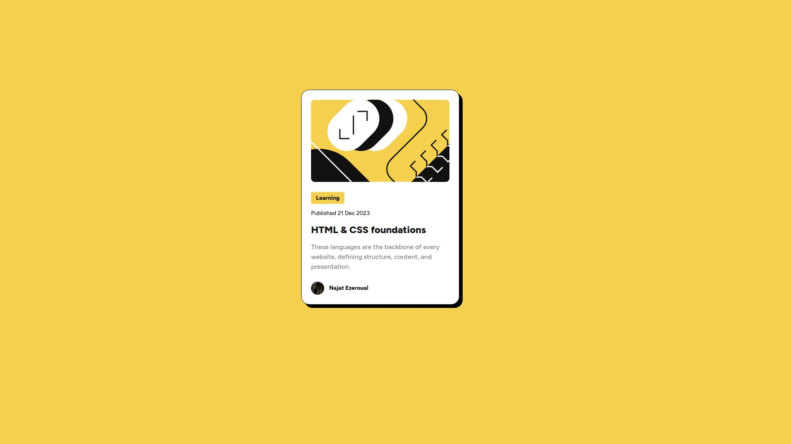

# Frontend Mentor - Blog preview card solution

This is a solution to the [Blog preview card challenge on Frontend Mentor](https://www.frontendmentor.io/challenges/blog-preview-card-ckPaj01IcS/hub). Frontend Mentor challenges help you improve your coding skills by building realistic projects.

## Table of contents

-   [Screenshot](#screenshot)
-   [Links](#links)
-   [Built with](#built-with)
-   [Author](#author)

### Screenshot

### Links

-   Solution URL: [Github repo](https://github.com/ezeroualnajat/Blog-preview-card)
-   Live Preview: [Go](https://najatezeroual.me/blog-preview-card)

### Built with

-   Semantic HTML5 markup
-   CSS custom properties
-   Flexbox

## Author

-   Website - [Najat Ezeroual](https://najatezeroual.me)
-   Frontend Mentor - [@ezeroualnajat](https://www.frontendmentor.io/profile/ezeroualnajat)
